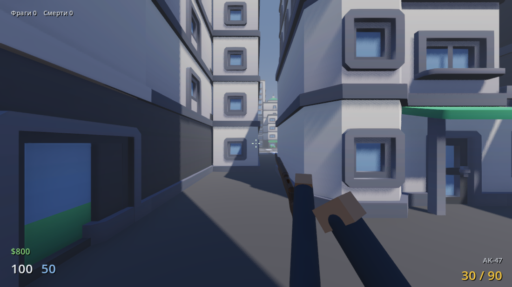
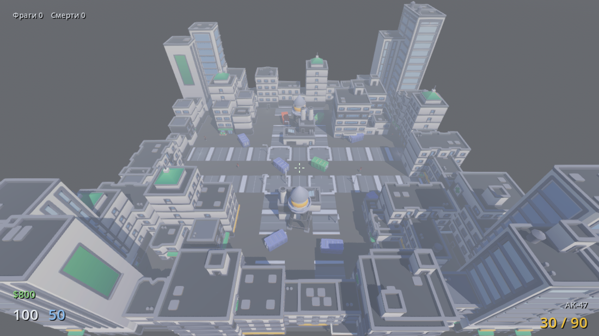
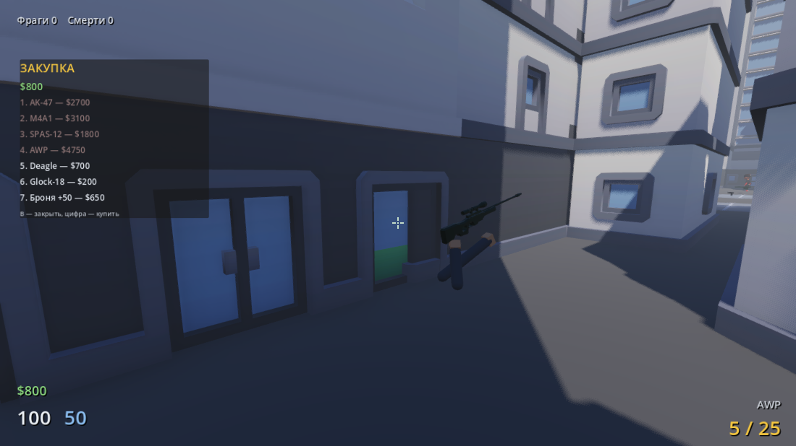
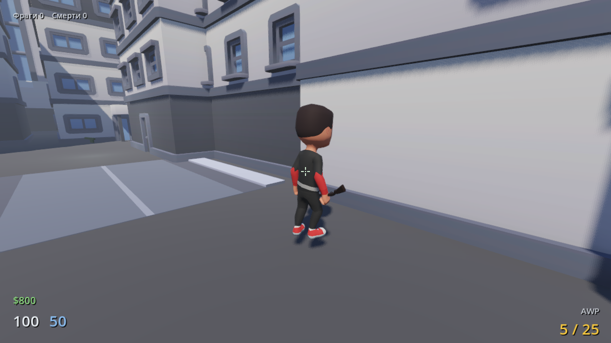

# Contra City — прототип на Godot 4

Сетевой шутер в духе «Контра Сити»: городской квартал, хитскан-стрельба с
разбросом и отдачей, боты-бойцы, подбор и покупка оружия.



| Карта | Закупка | Противник |
| --- | --- | --- |
|  |  |  |

Открыть: запустить Godot 4.6+ (разрабатывается на 4.7.2), добавить эту папку
как проект, нажать F5. Скрипты на GDScript, C# не нужен.

## Управление

| Клавиши | Действие |
| --- | --- |
| WASD | движение |
| Shift | бег |
| Ctrl | присед (меньше разброс, ниже силуэт) |
| Space | прыжок |
| ЛКМ | огонь |
| ПКМ | прицеливание |
| R | перезарядка |
| 1 / 2 / колесо | смена оружия |
| E | подобрать ствол с точки |
| B | магазин (покупка по цифрам) |
| Tab | таблица игроков и счёта |
| Esc | меню; в сетевом матче бой продолжается |

## Что уже работает

- **Стрельба.** Хитскан по лучу из центра экрана; разброс зависит от движения,
  прыжка, приседа и прицеливания, каждый выстрел добавляет разброс и отдачу.
  Прицел расходится ровно на текущий угол разброса.
  Очередь накапливает разброс, после паузы точность восстанавливается;
  боковую отдачу можно компенсировать мышью. При огне и прицеливании бег прекращается.
  Попадание рассчитывается из камеры, трассер и вспышка — из `MuzzleMarker`
  на скелете оружия. У ботов и сетевых соперников эффекты тоже привязаны к дулу.
- **Шесть стволов** с анимациями выстрела и перезарядки: AK-47, M4A1 (P90),
  SPAS-12 (9 дробин), AWP с оптикой, Deagle, Glock-18. У каждого свои урон,
  падение урона по дистанции, бронепробитие, отдача, скорость хода и цена.
  SPAS-12 заряжается по одному патрону: ЛКМ прерывает зарядку, когда есть
  чем выстрелить. Смена оружия отменяет перезарядку.
- **Прицеливание и вид оружия.** У каждого ствола свой `SightNode`: при ПКМ
  модель плавно совмещает его положение и направление с осью камеры.
  Экранный прицел затухает, FOV и чувствительность уменьшаются. Отдача работает
  на затухающих пружинах; инерция мыши и покачивание почти убираются в ADS.
  У каждого оружия свои скорость входа в ADS и зум; у пяти стволов есть
  открытый целик с контрастной мушкой, у AWP — круглый окуляр с сеткой.
  Пистолеты удерживаются двумя руками. Чувствительность учитывает проекцию FOV.
  Оружие рисуется прозрачным `SubViewport` поверх мира и не обрезается стенами.
  Его камера повторяет проекцию мировой камеры, чтобы начало трассера не
  расходилось с видимым дулом. Для этого зарезервирован слой рендера 20.
- **Магазин.** Деньги капают за убийства (+бонус за хедшот) и немного после
  смерти. На B открывается закупка: стволы и броня, покупка цифрами, игра при
  этом не встаёт на паузу.
- **Боты.** Модели бойцов Kenney с плавными переходами idle/run/jump. Патрулируют, замечают
  цель с проверкой линии огня, стрейфятся в бою, держат дистанцию, стреляют
  очередями с задержкой реакции, разворачиваются на выстрел в спину.
  При перезарядке отступают, при стрейфе обходят препятствия.
- **Анимации бойцов.** Общий `character_motion.gd` для ботов и удалённых игроков:
  дыхание, наклоны на поворотах, разворот ног при стрейфе, шаг назад,
  взгляд вверх/вниз, боевая стойка и хват оружия двумя руками через IK.
  Приседание сгибает ноги без сплющивания модели; после прыжка есть амортизация.
  Выстрел, получение урона и перезарядка двигают корпус и руки поверх базовых
  клипов. ADS, фаза перезарядки и состояние в воздухе передаются по сети.
- **Рэгдоллы и физика.** При смерти текущая поза переходит в отдельное тело:
  11 физических частей и 10 суставов, импульс по направлению попадания,
  столкновения с картой. Оружие выпадает и тоже реагирует на выстрелы.
  Респавн не перемещает старый труп. В сети передаётся направление импульса,
  а падение рассчитывается локально: трупы не блокируют боевой hitscan и игроков.
- **Попадания и гильзы.** Следы с неровными краями привязаны к поверхности;
  металл даёт искры и звон, бетон — крошку и пыль. Следы видны и от сетевых
  соперников. Гильзы вылетают, отскакивают от пола и звенят; у дробовика они
  отличаются цветом и размером. Дульная вспышка направлена вдоль ствола.
  На сцену оставляются максимум 8 тел, 128 следов, 48 гильз и 32 всплеска
  частиц. Тела исчезают через 14 секунд, следы через 30, гильзы через 6.
- **Карта.** Квартал 85×85 м из CC0-моделей Kenney: дома, небоскрёбы, заводы,
  перекрёстки с разметкой, контейнеры-укрытия. Собирается кодом по схеме.
- **Интерфейс.** Здоровье, броня, деньги, патроны, киллфид, счёт, хитмаркер
  (отдельный цвет для хедшота и убийства), вспышка урона, пауза.
  Дуга вокруг прицела показывает направление атакующего, полоска — ход
  перезарядки. При наведении на оружие появляется подсказка E с названием
  или сообщением о полном боезапасе; стены перекрывают подбор.
- **Звук.** Записанные выстрелы (CC0), остальное синтезируется кодом.

## Структура

```
scenes/    main, player, bot — сцены, которые правятся в редакторе
scripts/
  game.gd            матч: спавны, счёт, респавны, деньги за убийства
  map_builder.gd     сборка карты по схеме LAYOUT
  player.gd          движение, камера, присед, отдача
  weapon_manager.gd  инвентарь, стрельба, перезарядка, вид оружия
  view_model.gd      подгонка моделей оружия под вид от первого лица
  viewmodel_spring.gd  пружинная отдача без зависимости от FPS
  viewmodel_layer.gd   отдельный depth buffer и освещение оружия
  weapons_db.gd      каталог стволов и цен (autoload Weapons)
  weapon_data.gd     описание одного ствола
  bot.gd             ИИ противника
  character_model.gd сборка модели бойца со скином и анимациями
  economy.gd         деньги, shop.gd — магазин
  health.gd          здоровье и броня, damage.gd — единая точка урона
  effects.gd         трассеры, попадания, дульная вспышка
  sfx.gd             звук (autoload Sfx)
  hud.gd, crosshair.gd  интерфейс
  net_config.gd      настройки Photon (App ID лежит вне репозитория)
  net_api.gd         единственное место, где берётся синглтон Photon
  rate_limiter.gd    токен-бакет на входящие RPC
tools/     проверки и превью без редактора
assets/    модели города, оружия, бойцов и звуки
```

## Как править

- **Карта** — константа `LAYOUT` в `scripts/map_builder.gd`. Символ = клетка
  6.5 м: `#` дом, `I` завод, `x` контейнер, `t` водонапорка, `P` спавн игрока,
  `B` спавн бота, `w` точка оружия, `.` пусто.
- **Баланс и цены** — `scripts/weapons_db.gd`, по словарю на ствол.
- **Положение оружия в руках** — `model_rotation`, `model_offset`,
  `model_scale` в том же каталоге; HIP-позиция — в `weapon_manager.gd`.
  `muzzle` и `sight` задают маркеры в метрах в нейтральной подогнанной модели,
  `sight_rotation` — направление прицела, `eye_distance` — расстояние до глаза.
  При смене модели/масштаба эти точки надо перекалибровать. Во время игры они
  следуют кости Control; скелет и импортированные FBX менять не нужно.
- **Сложность ботов** — экспорты в `scripts/bot.gd`: `reaction_time`,
  `accuracy_penalty`, `sight_range`; количество — `bot_count` в `game.gd`.

## Проверки без редактора

```bash
Godot_v4.7.2-stable_win64.exe --headless --path . res://tools/smoke_test.tscn
```

Поднимает матч на 6 секунд и печатает состояние: объекты карты, позицию и
оружие игрока, сколько ботов живо и в бою, проходит ли урон, деньги.

```bash
Godot_v4.7.2-stable_win64.exe --headless --path . res://tools/regression_test.tscn
```

Регресс-стенд: проверки на каждый закрытый дефект, провал любой завершает
процесс кодом 1. Сюда же дописываются новые. Прогонять его вместе со сборкой
без Photon SDK удобнее через `./tools/run_offline_tests.ps1` — см. «Совместная
работа».

Скриншоты — `res://tools/screenshot.tscn`, контактный лист оружия —
`res://tools/viewmodel_preview.tscn` (оба без `--headless`).

Проверка стрельбы, перезарядки, подбора и анимаций:

```bash
Godot_v4.7.2-stable_win64.exe --headless --path . res://tools/combat_test.tscn
```

Проверяет темп M4 при 30/60/144 Гц, накопление разброса, расход патронов,
прерывание зарядки, блокировку подбора стеной и переходы анимаций.
Дополнительно проверяет ADS всех шести моделей, начало трассеров, выстрел
из-за укрытия, возврат позы после перезарядки и пружины при 30/60/144 FPS.
Для кадров HUD уберите `--headless` и добавьте `-- --capture`:
результат сохраняется в `build/combat-idle.png` и `build/combat-reload.png`.
Кадры ADS каждого ствола — `build/ads-<id>.png`, проверка стены — `build/ads-wall.png`.
В графическом прогоне дополнительно проверяется ПКМ: вход/выход ADS, зум и
видимость оптики; headless не поддерживает захват мыши и пропускает этот блок.

Проверка поз, хвата всех шести стволов, приседа, отдачи и сброса после респавна:

```bash
Godot_v4.7.2-stable_win64.exe --headless --path . res://tools/character_test.tscn
```

Без `--headless`, с `-- --capture` сохраняет кадры поз `build/character-<state>.png`.
`run_offline_tests.ps1` запускает оба набора вместе с регрессионными проверками,
как с установленным Photon SDK, так и без него.

Физические падения, суставы, импульсы, гильзы и ограничения эффектов:

```bash
Godot_v4.7.2-stable_win64.exe --headless --path . res://tools/physics_effects_test.tscn
```

Этот набор также включён в `run_offline_tests.ps1`. Графический запуск с
`-- --capture` сохраняет `build/physics-fall.png` и `build/physics-settled.png`.
Косметическая физика использует отдельный физический слой 5; она не меняет
коллизии живых бойцов и расчёт сетевого урона.

## Мультиплеер (Photon Fusion Godot)

Сеть работает на Photon Fusion Godot SDK 3.0 — GDExtension-аддон с API прямо
из GDScript. Режим Shared Authority: каждый владеет своим бойцом и реплицирует
его позицию, урон чужому игроку уходит RPC его владельцу. Комната живёт в
облаке Photon, выделенный сервер не нужен. Важно: SDK **в статусе preview**,
Photon сам пишет, что он не для продакшена.

Без установленного SDK доступен только офлайн-режим: игра запускается и
тренировка с ботами работает как обычно, а кнопка сетевой игры в меню
недоступна и в статусе написано, чего именно не хватает.

В главном меню укажите имя и комнату и нажмите «Играть по сети». Первый
вошедший запускает матч из лобби. Подключившиеся позже входят в текущий бой.
В сети играют только люди; для тренировки есть отдельный режим с ботами.
Обе стороны должны использовать одну версию сборки (сетевой протокол `0.3`).

Синхронизируются движение, поворот, приседание, оружие, здоровье, смерть,
возрождение и счёт. Попадание подтверждает владелец цели, после чего стрелок
получает хитмаркер и награду за убийство. Общие точки оружия обслуживает
текущий хост; их время восстановления хранится в комнате.

## Настройка у себя (и у второго разработчика)

Два файла не лежат в репозитории и ставятся вручную каждым: SDK —
проприетарный, его нельзя распространять, а App ID пускает чужих людей
в лимиты вашего аккаунта. Остальное клонируется как обычно.

1. Клонировать репозиторий и открыть папку как проект в Godot 4.6+.
2. Завести бесплатный аккаунт на [Photon](https://dashboard.photonengine.com)
   и скачать SDK со страницы
   [Fusion Godot SDK & Download](https://doc.photonengine.com/fusion-godot/v3-shared-authority/getting-started/sdk-download).
   Распаковать папку `fusion/` в `addons/` проекта и переоткрыть его.
3. Скопировать `photon.cfg.example` в `photon.cfg` и вписать App ID.

**Чтобы играть вместе, App ID должен быть одинаковым у обоих** — это одно
приложение Photon, и разные App ID означают разные комнаты. Проще всего
завести App ID один раз и передать строку напарнику личным сообщением, не
через репозиторий. Бесплатного плана хватает на 20 игроков онлайн.

Имя комнаты задаётся в меню (по умолчанию `contra-city`). Кто первым зашёл,
тот её и создал; остальные подключаются. Если хост выходит, его роль
переходит оставшемуся игроку, а матч продолжается.

Проверка двумя процессами через настоящий Photon, с отдельной тестовой комнатой:

```powershell
./tools/run_network_tests.ps1 -Godot "C:/path/to/Godot_v4.7.2-stable_win64_console.exe"
```

Ключ `-Capture` включает графику на втором клиенте и сохраняет кадр
`build/network-proof.png`. Тест проверяет камеры, модель соперника, разные
спавны, движение, оружие, хитскан, броню, смерть, награду, респавн, подбор
оружия, повторный вход и уход хоста, а также что жертва отбрасывает завышенный
урон и что смерть объявляет владелец цели. Логи сохраняются в
`build/network-*`.
Подробнее: [устройство сетевого режима](docs/network.md).

Быстрая проверка одного процесса — что вообще мешает поднять сеть:

```bash
Godot_v4.7.2-stable_win64.exe --headless --path . res://tools/net_test.tscn
```

Печатает, чего не хватает, дошло ли дело до комнаты и сколько в ней игроков.

## Совместная работа

- `.godot/` в git не попадает, а вот `*.import` — попадает: без них Godot
  переимпортирует ассеты и в diff падает мусор.
- Сцены Godot плохо мержатся: если правите одну и ту же сцену вдвоём, лучше
  договариваться заранее, чем разбирать конфликт в `.tscn`.
- Перед пушем стоит прогнать `res://tools/smoke_test.tscn` — он за 6 секунд
  скажет, не развалились ли карта, боты, урон и экономика.
- Перед пушем стоит прогнать `./tools/run_offline_tests.ps1 -Godot <путь>` — он
  проверяет и сборку без Photon SDK, то есть офлайн-режим у того, кто SDK ещё
  не поставил.

## Чего ещё нет

- Режимов матча, второй карты, гранат и ножа.
- Рук от первого лица: в паке Quaternius только оружие. Готовых CC0-рук с
  анимациями под прямую загрузку найти не удалось — нужен ручной импорт,
  например [PSX First Person Arms](https://drillimpact.itch.io/psx-first-person-arms-free).
- Моделей игрока от третьего лица: у своего игрока тело — капсула, у ботов
  модель есть.

## Лицензии ассетов

- Город — [Kenney](https://kenney.nl), CC0: [City Kit
  Commercial](https://kenney.nl/assets/city-kit-commercial), [City Kit
  Industrial](https://kenney.nl/assets/city-kit-industrial), [City Kit
  Roads](https://kenney.nl/assets/city-kit-roads).
- Бойцы — [Kenney Animated Characters
  Protagonists](https://kenney.nl/assets/animated-characters-protagonists), CC0.
- Оружие — [Quaternius Animated Guns
  Pack](https://quaternius.com/packs/animatedguns.html), CC0.
- Звуки выстрелов — [The Free Firearm Sound
  Library](https://opengameart.org/content/the-free-firearm-sound-library), CC0.

CC0 — можно использовать как угодно, в том числе коммерчески, без указания
авторства.
